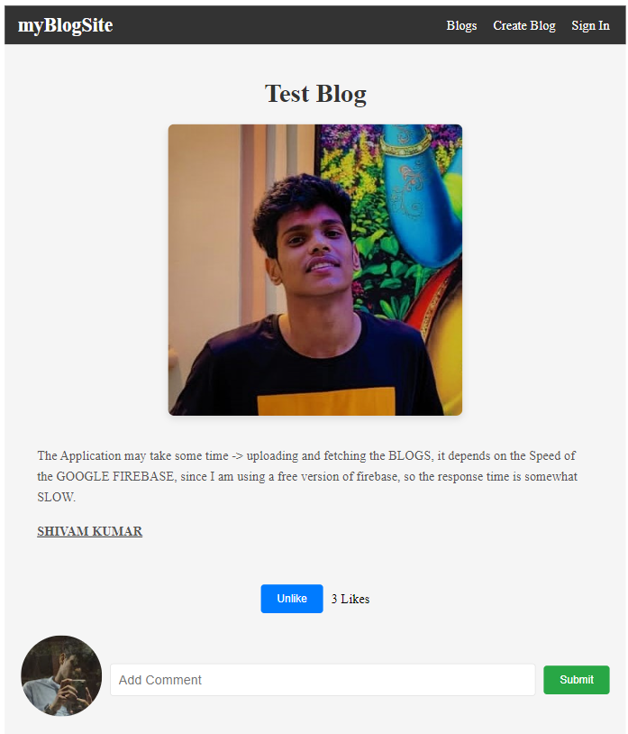

<h1 align="center"> myBlogSite </h1>

## Live Link:

    https://shhiivvaam-myblogsite.netlify.app/

### OBJECTIVE :

    This project is a Personal Blog Application developed using React.
    The objective is to evaluate proficiency in creating React applications
    with client-side routing, managing application state, and handling dynamic data.
    The application allows users to read, post, and delete blog posts.

### FEATURES LIST :

    1. Blog Posts: Displays a list of blog post that summaries (title and snippet) with links to full blog posts.
    2. Categories: Easily navigate through different categories to find content that interests you the most.
    3. Search: Use the search functionality to quickly find specific topics or posts.
    4. Responsive Design: Enjoy a seamless experience whether you're browsing on a desktop, tablet, or mobile device.



### Technologies Used

    Framework: React
    Database : Firebase
    Deployment : Netlify

# Run Scripts

```Terminal
git clone https://github.com/shhiivvaam/myblogsite.git

cd myblogsite
npm install
npm start / npm run start
```

Thank you for visiting!
